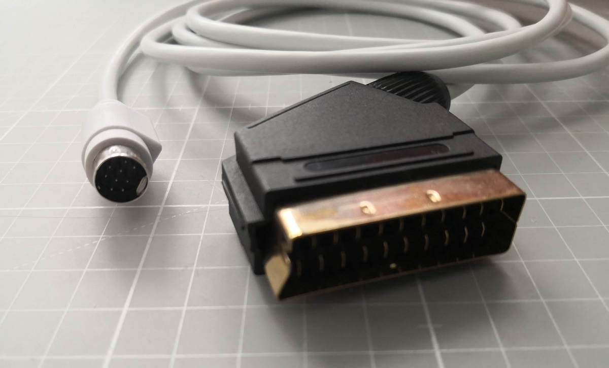
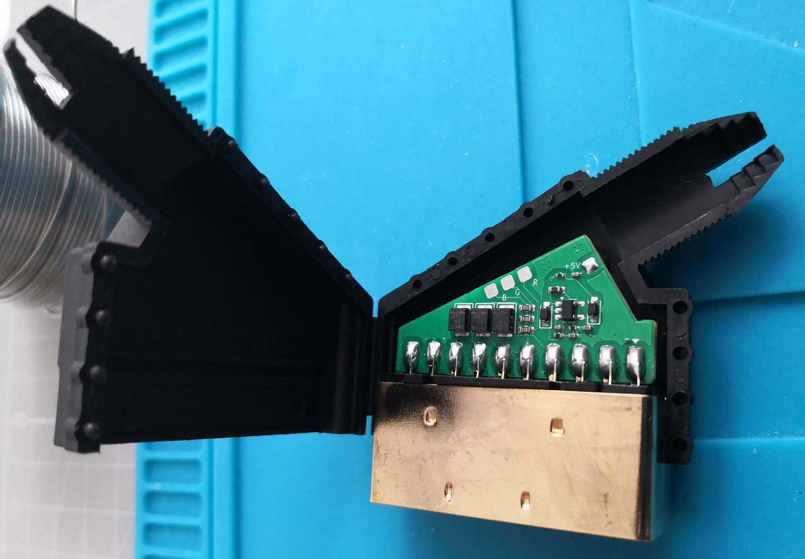
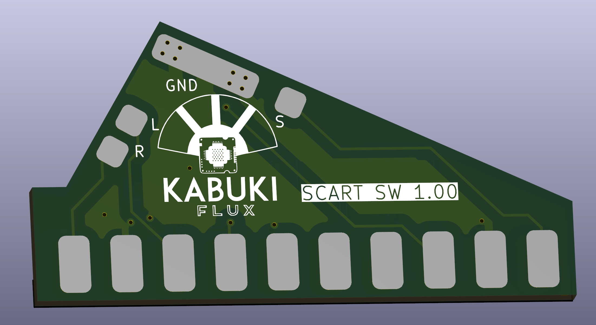
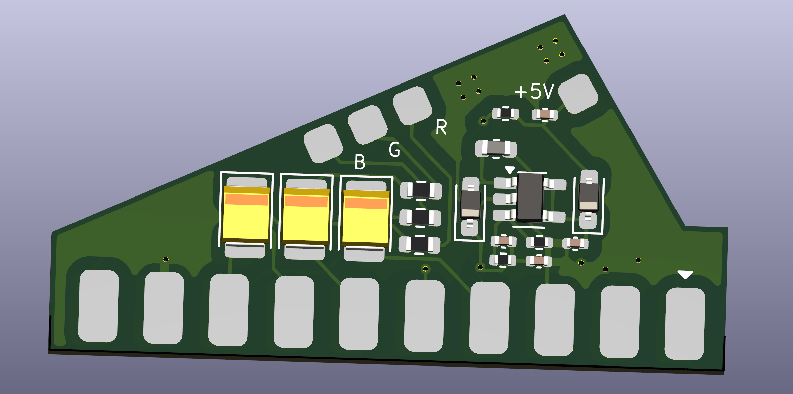
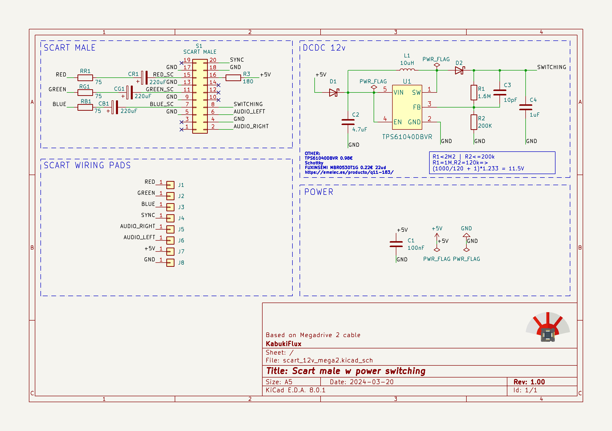
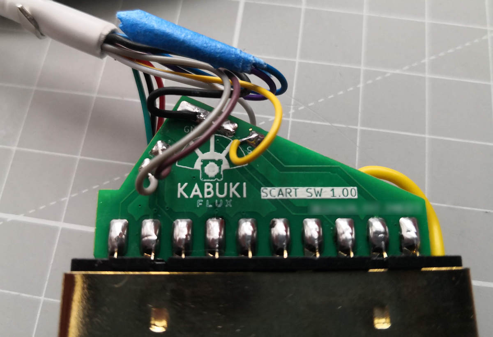
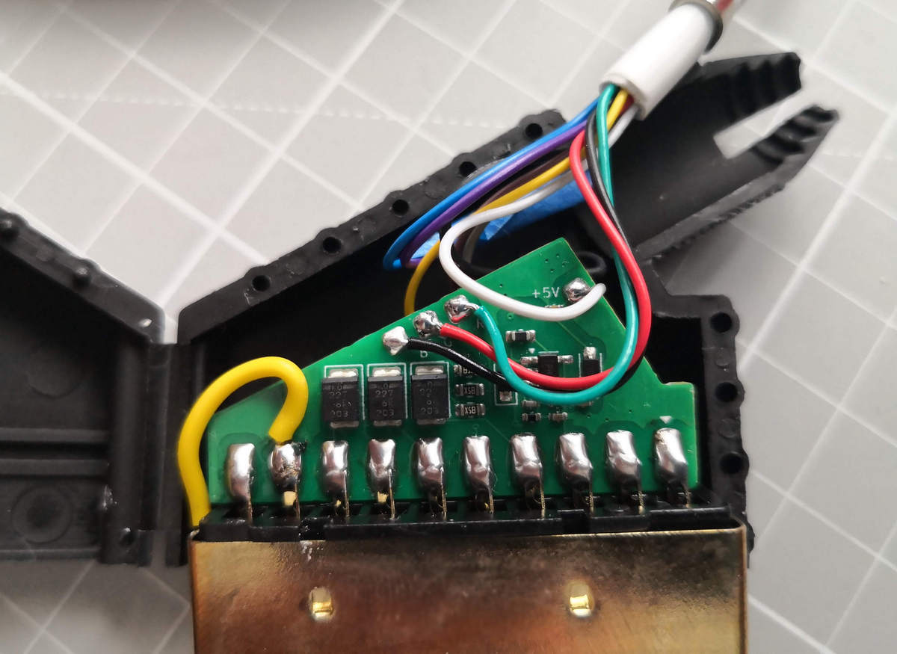

# Megadrive/Genesis 2 to Scart adapter with 12V

<b align="center">PCB form Megadrive/Genesis 2 RGB minidin to Scart adapter with 12V DCDC boost (4:3 switching)</b>

## Table of contents

- [Why](#why)
- [Description](#description)
- [Schematics](#schematics)
- [Install](#install)
- [Pics and final result](#pics-and-final-result)
- [Premade cables with minidin 9](#premade-cables-with-minidin-9)

## Why?

When we plug a Megadrive 2 console via scart on the "newer" CRT TVs as the minidin provides 5v on the console side the
tv will switch to AV with a 16:9 aspect ratio. We need to deliver between 9v to 12v on the swtiching side to output
directly to AV with 4:3 aspect ratio.

## Description

This is intended to be a PCB using the default Megadrive/Genesis 2 RGB cable schematic but adding the 12v DC-DC switching boost
on the scart side from the 5v supplied by the MD2.

This board intends to provide a standard Sega Megadrive 2 RGB cable (Sega Genesis).

In the BOM directory there's an interactive BOM with all the required components.

In the gerbers directory we have the gerbers to manufacture the boards.

In the KiCAD folder we can find the KiCAD project itself.

## Schematics

You can find a copy on PDF on the root of the repository.

## Install

1- Send to manufacture the GERBER board to JLCPCB or other PCB manufacturer.

2- Get the components required, you can see here the Bill Of Materials [BOM](ibom.html)

3- Solder the wire to each of the pads and to the scart male.

4- Remember to solder the shield of the scart to the GND as well to avoid noise issues.

### Pics and final result

At this stage you should have something like this:

## Premade cables with minidin 9

Of course you can always try to solder the minidin 9 connectors from Aliexpress, good luck with that!

(You will need good flux and scratch the surface - some of them are almost imposible)

But my recommendation is to buy these ones:

1- RS 75ohm cable with shield: [RS Spain link code 724-1150](https://es.rs-online.com/web/p/cables-din/7241150)

2- Minidin 9 male to male cable: [Aliexpress 3m male to male with shield](https://es.aliexpress.com/item/1005006201886253.html)

I'm not responsible
============
And yes, read below, no responsibility taken on bad use.

DISCLAIMER (See Licensing)
==========================
See LICENSE for more information.